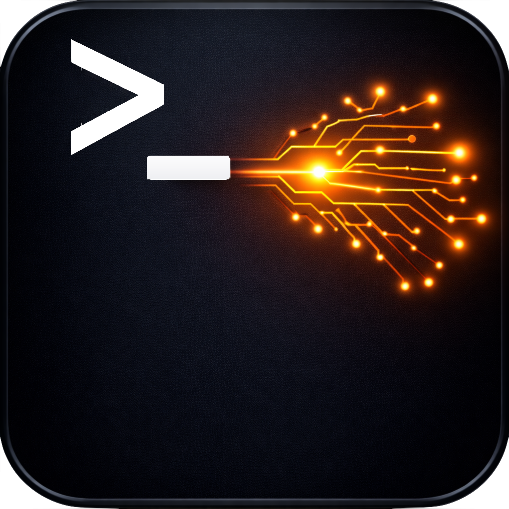
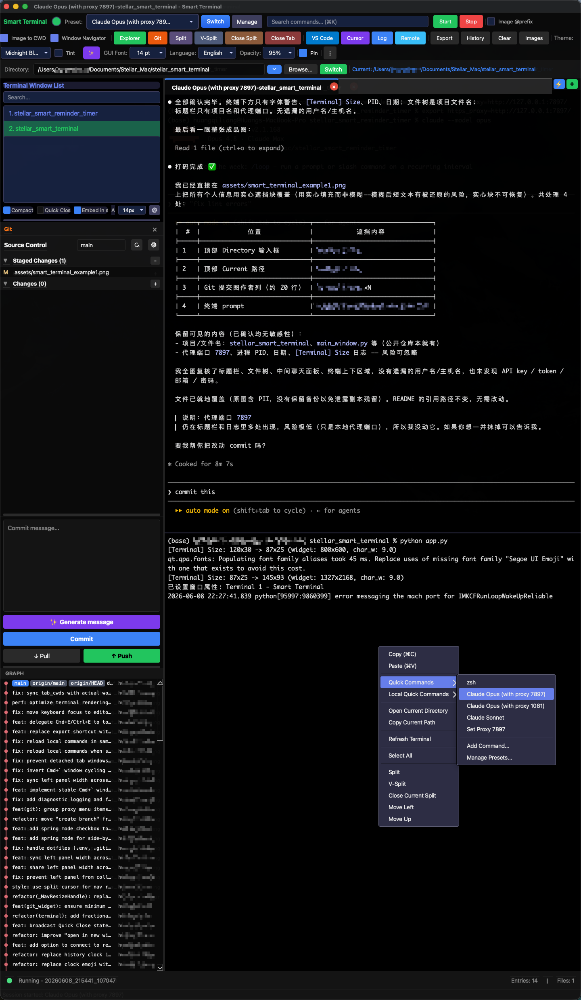

# Stellar Smart Terminal

基于 PyQt6 的智能终端，集成文件管理、Git GUI、LLM 代理和 VS Code 扩展浏览。

A PyQt6-based smart terminal with file explorer, Git GUI, LLM proxy, and VS Code extension browser.



## Screenshot / 界面预览



> 多面板布局：文件管理 / Git、代码编辑器与多标签终端集成在一个窗口中。
> Multi-pane layout: file explorer / Git, code editor, and multi-tab terminal in one window.

## Features / 功能

- **Multi-tab Terminal / 多标签终端** — session management / 会话管理
- **File Explorer & Editor / 文件管理与编辑器**
- **Git GUI** — stage, commit, push, pull, diff, branch
- **LLM Proxy / LLM 代理** — OpenAI-compatible / 兼容 OpenAI 接口
- **VS Code Extensions / VS Code 扩展浏览**
- **i18n** — English / 中文

## Download / 下载安装

无需安装 Python，从 [**Releases**](https://github.com/StellarStar255/stellar_smart_terminal/releases/latest) 下载即可使用。
No Python required — grab a build from the [**Releases**](https://github.com/StellarStar255/stellar_smart_terminal/releases/latest) page.

1. 下载 `Stellar-Smart-Terminal-vX.Y.Z-macOS-arm64.dmg`（推荐；也提供 zip）
   Download the `.dmg` (recommended; a zip is also available)
2. 打开 DMG，把 `Stellar Smart Terminal.app` 拖进 `Applications` 文件夹
   Open the DMG and drag the app into the `Applications` folder
3. 首次启动若提示 **"Stellar Smart Terminal" Not Opened**（应用暂未签名）：点 **完成/Done**，到 **系统设置 → 隐私与安全性** 底部点 **仍要打开 (Open Anyway)**；或在终端执行：
   On first launch, if macOS blocks the app (it is not code-signed yet): click **Done**, then go to **System Settings → Privacy & Security** and click **Open Anyway** — or run:

   ```bash
   xattr -cr "/Applications/Stellar Smart Terminal.app"
   ```

> 目前仅提供 Apple Silicon (arm64) 构建。
> Currently Apple Silicon (arm64) only.

## Quick Start (from source) / 源码运行

```bash
pip install -r requirements.txt
python app.py
```

## Requirements / 依赖

- Python 3.10+
- PyQt6 >= 6.5.0
- pyte >= 0.8.0

## Troubleshooting / 故障排除
```shell
pip uninstall PyQt6 PyQt6-Qt6 PyQt6-sip -y
pip install PyQt6==6.7.1 PyQt6-Qt6==6.7.1 --no-cache-dir
```

## Guides / 指南

- [Claude Code 通知点击跳转 / Click-to-focus notifications (macOS)](docs/claude-code-notifications.md) — Stop hook 配置，点击通知直接跳回对应 Smart Terminal 窗口
- [打包与发布 / Packaging & Release](docs/PACKAGING.md) — 从 `./build.sh` 打包到 GitHub Release 发版的完整流程
- [macOS 权限与责任进程 / macOS permissions & responsible process](docs/macos-permissions.md) — 为何终端里的程序用麦克风/摄像头会闪退，Info.plist 用途声明与四类需手动授权的权限

## Build / 打包

打包为独立应用（onedir 模式，无需安装 Python）。
Package as a standalone app (onedir mode, no Python required).

```bash
# macOS — 产出 dist/Stellar Smart Terminal.app 和拖拽安装的 .dmg
./build.sh
open "dist/Stellar Smart Terminal.app"
```

```bat
:: Windows — 产出 dist\StellarSmartTerminal\StellarSmartTerminal.exe
build.bat
```

> 脚本会自动创建独立虚拟环境 `.venv-build`、安装依赖与 PyInstaller，macOS 下还会从 `assets/smart_terminal.png` 生成 `.icns` 图标并打出 DMG。配置见 `smart_terminal.spec`。
> The script creates an isolated `.venv-build` venv, installs dependencies + PyInstaller, and (on macOS) generates the `.icns` icon from `assets/smart_terminal.png` and a drag-to-install DMG. See `smart_terminal.spec` for configuration.
>
> 完整的版本发布流程（版本号、tag、GitHub Release）见 [docs/PACKAGING.md](docs/PACKAGING.md)。
> For the full release workflow (version bump, tag, GitHub Release), see [docs/PACKAGING.md](docs/PACKAGING.md).

## License / 许可

[MIT](LICENSE)